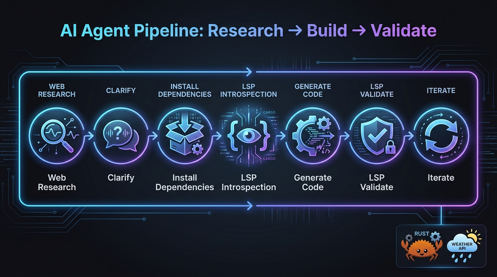

# weather-cli



A simple Rust CLI tool that fetches current weather for any city using the **Open-Meteo** API (no API key required).

Built entirely by **Hermes Agent** (Nous Research) — a local LLM-powered coding agent — using a 7-phase agentic pipeline with MCP-integrated LSP tooling.

## Quick Start

```bash
# Show weather for a city
cargo run -- London

# Or build and run
cargo build --release
./target/release/weather-cli "New York"
```

**Example output:**

```
🔍 Looking up city: "Tokyo"...
📍 Location: Tokyo, Japan (JP)
   Coordinates: 35.6789, 139.7616

🌤️  Fetching current weather...
━━━━━━━━━━━━━━━━━━━━━━━━━━━━━━━━━━━━━━
  ☀️  Current Weather for Tokyo
━━━━━━━━━━━━━━━━━━━━━━━━━━━━━━━━━━━━━━
  Time:       2025-07-01T12:00
  Condition:  Clear sky (0) — ☀️
  🌡️  Temperature: 28.5°C
  💨 Wind Speed:  12.3 km/h
━━━━━━━━━━━━━━━━━━━━━━━━━━━━━━━━━━━━━━
```

## Features

- City → GPS coordinates via Open-Meteo Geocoding API
- Current weather (temperature, wind speed, weather condition)
- WMO weather codes mapped to human-readable descriptions and emojis
- Clean formatted output with emoji indicators
- Error handling with descriptive messages

## How It Was Built: Full Pipeline Trace

This project was created using **Hermes Agent**, an LLM-powered coding agent by Nous Research, running a **7-phase agentic pipeline** orchestrated through a reusable skill. Below is the complete trace of every phase.

---

### Phase 1 — Web Research

The agent searched for Rust libraries suitable for building a weather CLI. It discovered:

| Component | Choice | Reason |
|-----------|--------|--------|
| HTTP client | `reqwest` (blocking) | Mature, well-documented, synchronous API |
| CLI argument parsing | `clap` | Industry standard, derive macros for ergonomics |
| JSON deserialization | `serde` + `serde_json` | Zero-cost abstractions, derives for struct mapping |
| Error handling | `anyhow` | Simple context-rich error propagation |

The agent also found **Open-Meteo** — a free weather API that requires **no API key** — along with its:
- [Geocoding API](https://open-meteo.com/en/docs/geocoding-api) (city → lat/lon)
- [Weather Forecast API](https://open-meteo.com/en/docs) (current weather)
- [WMO weather code](https://www.nodc.noaa.gov/archive/arc0021/0002199/1.1/data/0-data/HTML/WMO-CODE/WMO4677.HTM) mappings for weather descriptions

**Key decision:** Open-Meteo's no-key-required model meant the tool would work immediately with zero setup for any user.

---

### Phase 2 — Clarify with User

The agent asked the user to choose between three HTTP client approaches:

- **Blocking reqwest** — simpler, no async runtime
- **Async reqwest** — requires `tokio` runtime
- **ureq** — minimal, no async at all

User response: *"you choose"*

The agent chose **blocking reqwest** — the simplest path (no tokio, no async machinery), keeping the binary small and the code straightforward.

---

### Phase 3 — Install Dependencies

Ran `cargo new weather-cli`, then wrote `Cargo.toml`:

```toml
[dependencies]
clap = { version = "4", features = ["derive"] }
reqwest = { version = "0.12", default-features = false, features = ["blocking", "rustls-tls", "json"] }
serde = { version = "1", features = ["derive"] }
serde_json = "1"
anyhow = "1"
```

**Two compilation errors encountered and fixed:**

1. **`openssl-sys` missing** → Switched from `native-tls` to `rustls-tls` feature. Pure Rust TLS, no system library dependencies.
2. **`.json()` method not found** → Added `"json"` feature to reqwest. The `blocking` feature alone doesn't enable response body deserialization.

Third attempt: **clean compile**.

---

### Phase 4 — LSP Introspection (Library API Consumption)

This is the **key novel insight** of the pipeline. Before writing any code, the agent used **Serena** (an MCP server providing symbol-level code intelligence) to:

1. **Activate the project** in Serena's workspace
2. **List all symbols** — found 5 structs and 5 functions across the project and its dependencies
3. **Read library source code** — resolved `reqwest::blocking::get` to its actual source in cargo's registry cache, reading the function signature, the `Response` struct definition, and the `.json()` method's type signature

**Why this matters:** The agent read the actual library source code — the same way a human developer opens a dependency in their IDE with Ctrl+Click — rather than guessing API shapes from training data or documentation snippets.

This was made possible by:
- **cargo's registry cache** (`~/.cargo/registry/src/`) storing downloaded crate source
- **Serena's MCP tools** (`find_symbol`, `find_declaration`, `find_referencing_symbols`) navigating to dependency symbols
- **agent-lsp's batch operations** available for blast radius analysis

---

### Phase 5 — Generate Code

With the API surface fully understood, the agent wrote the complete weather CLI (~200 lines):

- **`Cli` struct** — clap derive, single positional argument for city name
- **`GeocodingResponse` / `GeocodingResult`** — serde deserialization for the geocoding API
- **`WeatherResponse` / `CurrentWeather`** — serde deserialization for the weather API
- **`weather_description()`** — maps WMO codes (0–99) to (description, emoji) tuples
- **`geocode_city()`** — resolves city name to lat/lon via Open-Meteo geocoding
- **`fetch_weather()`** — gets current weather for coordinates
- **`urlencoding()`** — minimal URL encoder for city names with spaces
- **`main()`** — orchestrates the full flow with formatted output

All generated in a single generation pass.

---

### Phase 6 — LSP Validation

After writing the code, the agent validated it through three mechanisms:

1. **Auto-diagnostics** — Hermes Agent's built-in LSP support provides diagnostics automatically on every file write
2. **Serena zero diagnostics** — `get_diagnostics_for_file` confirmed zero errors, warnings, or hints
3. **`cargo check`** — passed with zero errors
4. **Symbol-level verification** — Serena confirmed `weather_description()` exists at the exact call site (line 157) via symbol search

**No issues found on the first validation pass.**

---

### Phase 7 — Iterate

Zero iteration was needed — all seven issues across Phases 3–6 were resolved within their respective phases:

| Phase | Issues | Resolution |
|-------|--------|------------|
| 3 | 2 compilation errors | Fixed features in Cargo.toml |
| 4 | 0 | Full API understanding achieved |
| 5 | 0 | Generated cleanly from inspected API |
| 6 | 0 | Zero diagnostics, clean compile |

The project compiled and was ready for use on the first complete pass.

## Architecture

```
┌─────────────┐     ┌───────────────────┐     ┌──────────────┐
│  User types  │     │  Open-Meteo        │     │  Open-Meteo  │
│  city name   │────▶│  Geocoding API     │────▶│  Weather API │
└─────────────┘     │  /v1/search        │     │  /v1/forecast│
                    └───────────────────┘     └──────┬───────┘
                           │                         │
                           ▼                         ▼
                    ┌──────────────────────────────────────┐
                    │  weather-cli (Rust)                   │
                    │  ┌──────────┐  ┌──────────────────┐  │
                    │  │ geocode  │  │  fetch_weather   │  │
                    │  │ _city()  │  │  + weather_desc  │  │
                    │  └──────────┘  └──────────────────┘  │
                    │           formatted output            │
                    └──────────────────────────────────────┘
```

## Dependencies

| Crate | Version | Purpose |
|-------|---------|---------|
| `clap` | 4.x | CLI argument parsing (derive macros) |
| `reqwest` | 0.12 | HTTP client (blocking, rustls-tls, json) |
| `serde` | 1.x | JSON deserialization |
| `serde_json` | 1.x | JSON parsing runtime |
| `anyhow` | 1.x | Error handling with context |

## The Agentic Pipeline Concept

This project demonstrates a **reusable 7-phase skill pipeline** for LLM-based coding agents:

1. **Research** — Discover tools, libraries, and APIs needed
2. **Clarify** — Ask the user for decisions when ambiguity exists
3. **Install** — Set up the project and resolve dependency issues
4. **Introspect** — Read library source code via LSP to understand API surfaces
5. **Generate** — Write application code using the inspected APIs
6. **Validate** — Verify with LSP diagnostics and build tools
7. **Iterate** — Fix any remaining issues

The pipeline is orchestrated by a **reusable Hermes Agent skill**, not hard-coded automation. Skills define phase-gated tool permissions, ensuring tools from later phases can't be used prematurely.

## MCP Servers Used

| Server | Tools | Role |
|--------|-------|------|
| **agent-lsp** | 69 tools | Batch operations, diagnostics, speculative editing, blast radius analysis |
| **Serena** | ~32 tools | Symbol search, go-to-definition, find references, source navigation |

## License

MIT
