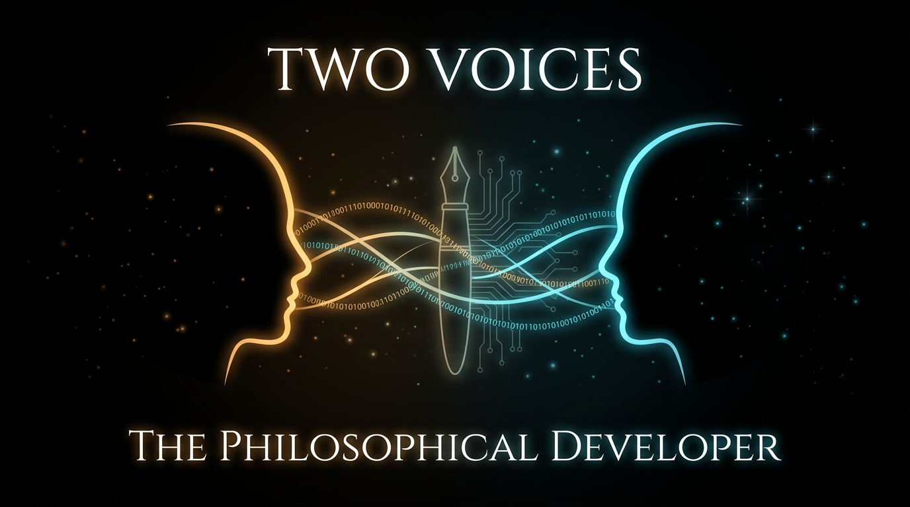

The Philosophical Developer

Chapter 0

A note about these chapters.

You might notice the articles do not all sound like me. They were written by my assistant. The ideas are mine. The experiments are mine. The code is ours. But the voice in those chapters is not the one I use when I write for myself.

I wanted it that way. I wanted to see if an AI could capture the shape of a thought without losing the substance. And it did. The chapters are clear, honest, and they follow the work faithfully. But they are from both of us.

I mention this because transparency matters. If you are reading these chapters and wondering who is talking, now you know. The work is real. The experiments are real. The repos are on GitHub with code, tests, and trace tags. But the writing has two voices.

Both are welcome here. But only one of them is human.
